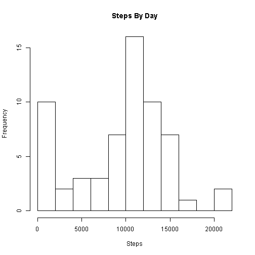
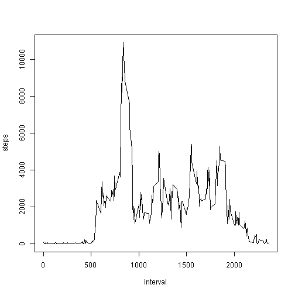
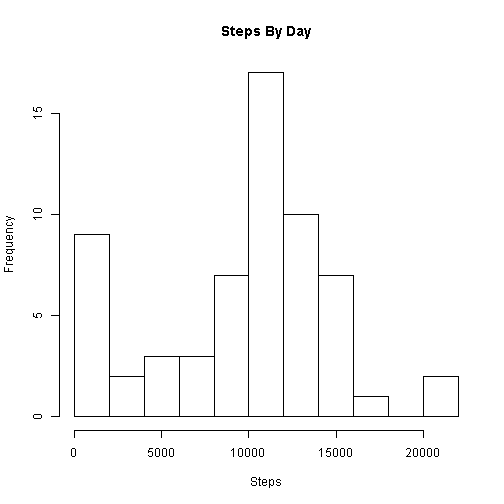
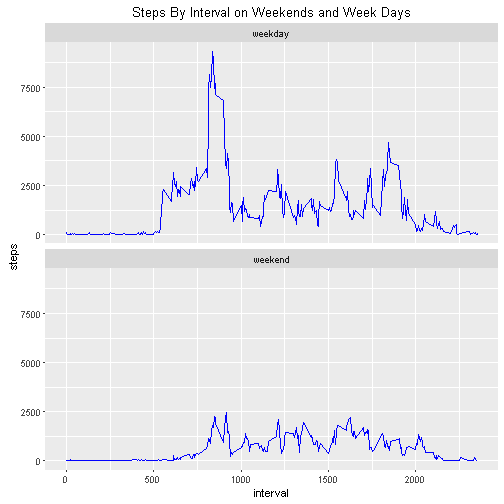

## Loading and preprocessing the data
1. Load the data  

```r
activity = read.csv("activity.csv")
```

2. Transform the data into a format suitable for your analysis. We aggregate steps by day

```r
activity_daily_steps = aggregate(x = list(steps = activity$steps) , by = list(date = activity$date), FUN = sum, na.rm = TRUE)
```


## What is mean total number of steps taken per day?
1. Make a histogram of the total number of steps taken each day

```r
hist(activity_daily_steps$steps, main="Steps By Day", xlab = "Steps", breaks=10)
```



2. Calculate and report the mean and median total number of steps taken per day

```r
mean_steps = mean(activity_daily_steps$steps, na.rm = TRUE)
median_steps = median(activity_daily_steps$steps, na.rm = TRUE)
```
The mean is **9354.2295082** steps per day and the median is **10395**.

    

## What is the average daily activity pattern?
1. Make a time series plot of the 5-minute interval (x-axis) and the average number of steps taken, averaged across all days (y-axis)

```r
activity_int_steps = aggregate(x = list(steps = activity$steps) , by = list(interval = activity$interval), FUN = sum, na.rm = TRUE)
plot(steps ~  interval, data = activity_int_steps,type="l")
```



2. Which 5-minute interval, on average across all the days in the dataset, contains the maximum number of steps?

```r
max_interval = activity_int_steps[which.max(activity_int_steps$steps),1]
```

The max steps are found in interval **835**


## Imputing missing values

1. Calculate and report the total number of missing values in the dataset (i.e. the total number of rows with NAs)

```r
missing_points = sum(is.na(activity$steps))
```
Total number of missing values is **2304**.

2. Devise a strategy for filling in all of the missing values in the dataset. The strategy does not need to be sophisticated. For example, you could use the mean/median for that day, or the mean for that 5-minute interval, etc.

We will be populating NA values witht he mean value for that interval. Code is in step 4

3. Create a new dataset that is equal to the original dataset but with the missing data filled in.

This is created as activity_nona below (step 4)


4. Make a histogram of the total number of steps taken each day and Calculate and report the mean and median total number of steps taken per day. Do these values differ from the estimates from the first part of the assignment? What is the impact of imputing missing data on the estimates of the total daily number of steps?

```r
interval_means = aggregate(x = list(steps = activity$steps), by = list(interval = activity$interval), FUN = mean, na.rm = TRUE)
activity_nona = activity

activity_nona[which(is.na(activity_nona$steps)),]$steps = interval_means[interval_means$interval == activity_nona[which(is.na(activity_nona$steps)),]$interval,]$steps

activity_daily_steps_nona = aggregate(x = list(steps = activity_nona$steps) , by = list(date = activity_nona$date), FUN = sum, na.rm = TRUE)


hist(activity_daily_steps_nona$steps, main="Steps By Day", xlab = "Steps", breaks=10)
```



```r
mean_steps_nona = mean(activity_daily_steps_nona$steps, na.rm = TRUE)
median_steps_nona = median(activity_daily_steps_nona$steps, na.rm = TRUE)
```

The mean is **9530.7244046** steps per day and the median is **1.0439 &times; 10<sup>4</sup>** compared to mean of **9354.2295082** and median of **1.0439 &times; 10<sup>4</sup>**  without removal of NAs.


## Are there differences in activity patterns between weekdays and weekends?
1. Create a new factor variable in the dataset with two levels -- "weekday" and "weekend" indicating whether a given date is a weekday or weekend day.

```r
activity_nona$day_type = ifelse(weekdays(as.Date(activity_nona$date, abbreviate = TRUE)) %in% c("Saturday", "Sunday"), "weekend", "weekday")
```

2. Make a panel plot containing a time series plot (i.e. type = "l") of the 5-minute interval (x-axis) and the average number of steps taken, averaged across all weekday days or weekend days (y-axis). The plot should look something like the following, which was created using simulated data:


```r
activity_int_steps_nona  = aggregate(x = list(steps = activity_nona$steps) , by = list(interval = activity_nona$interval, day_type = activity_nona$day_type), FUN = sum, na.rm = TRUE)

library(ggplot2)
ggplot(data = activity_int_steps_nona, aes(x = interval, y = steps)) + geom_line(color="blue") +
facet_wrap( ~ day_type, ncol=1) +
ggtitle("Steps By Interval on Weekends and Week Days")
```




